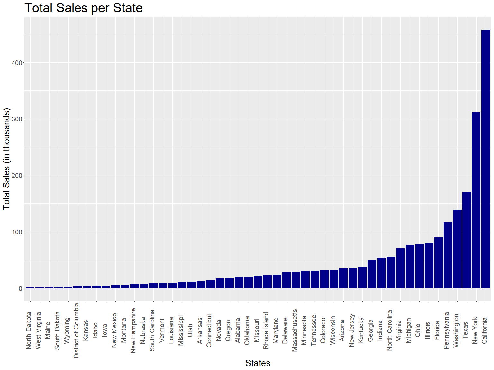
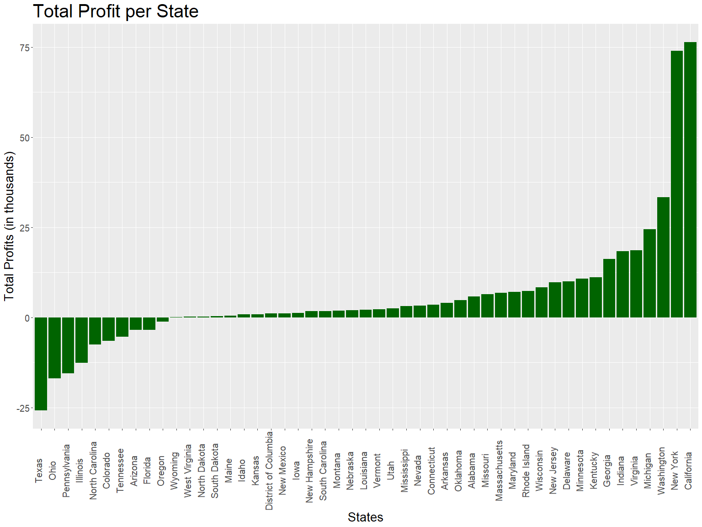
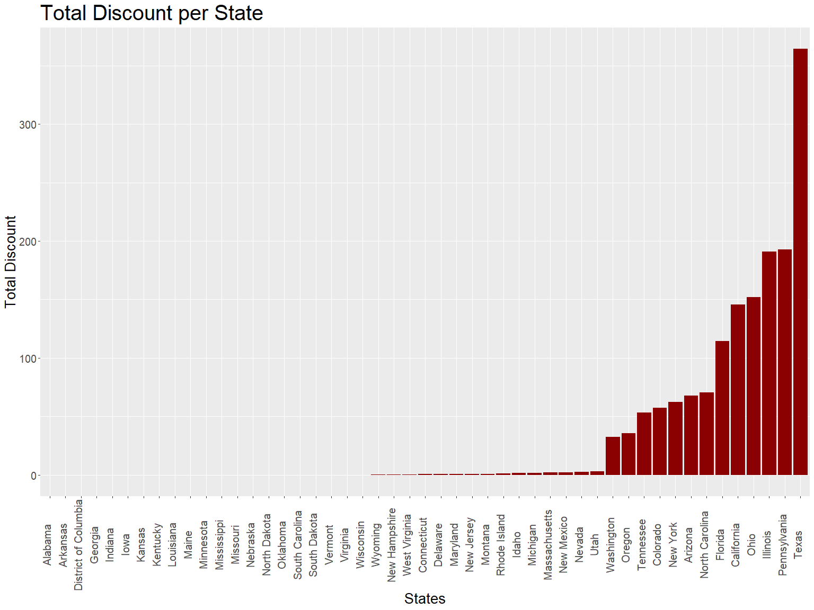
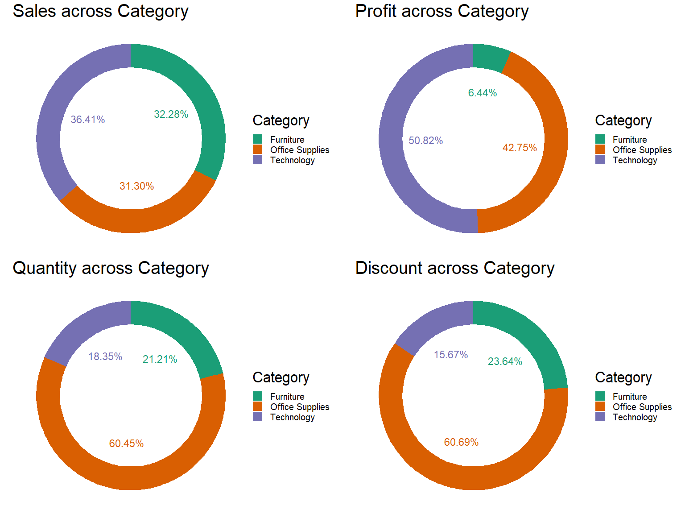
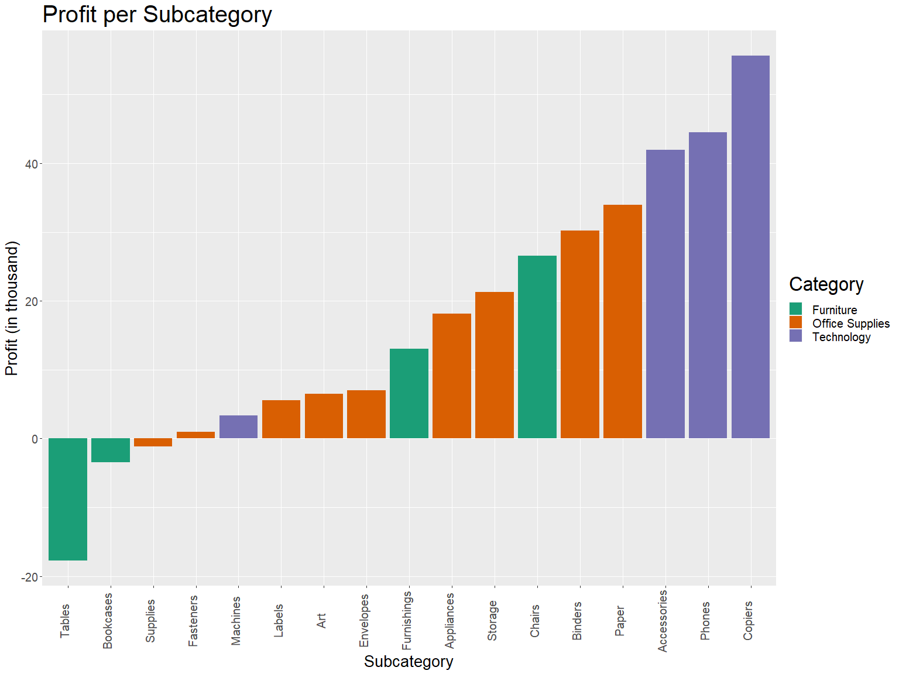
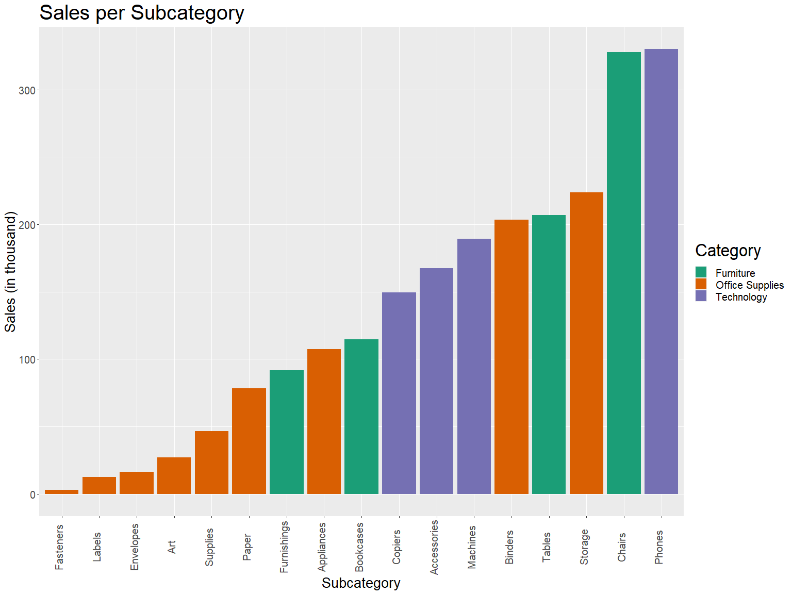
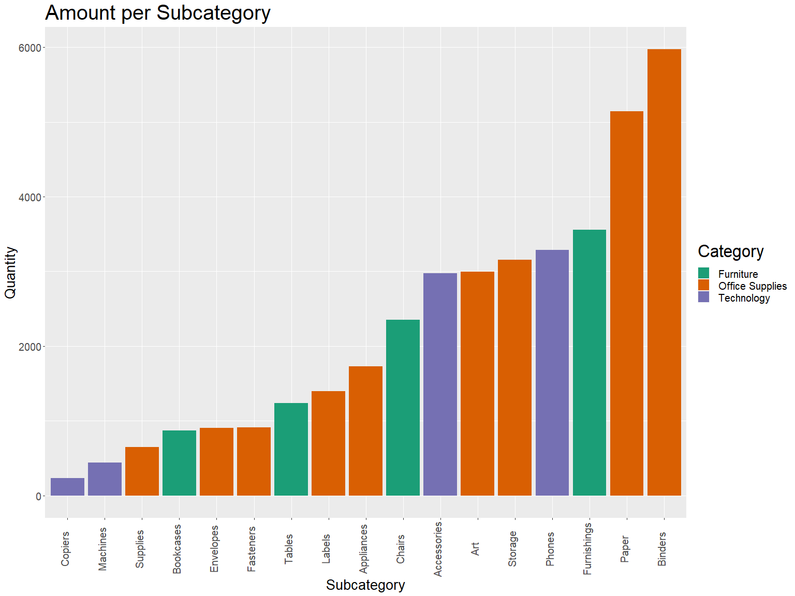
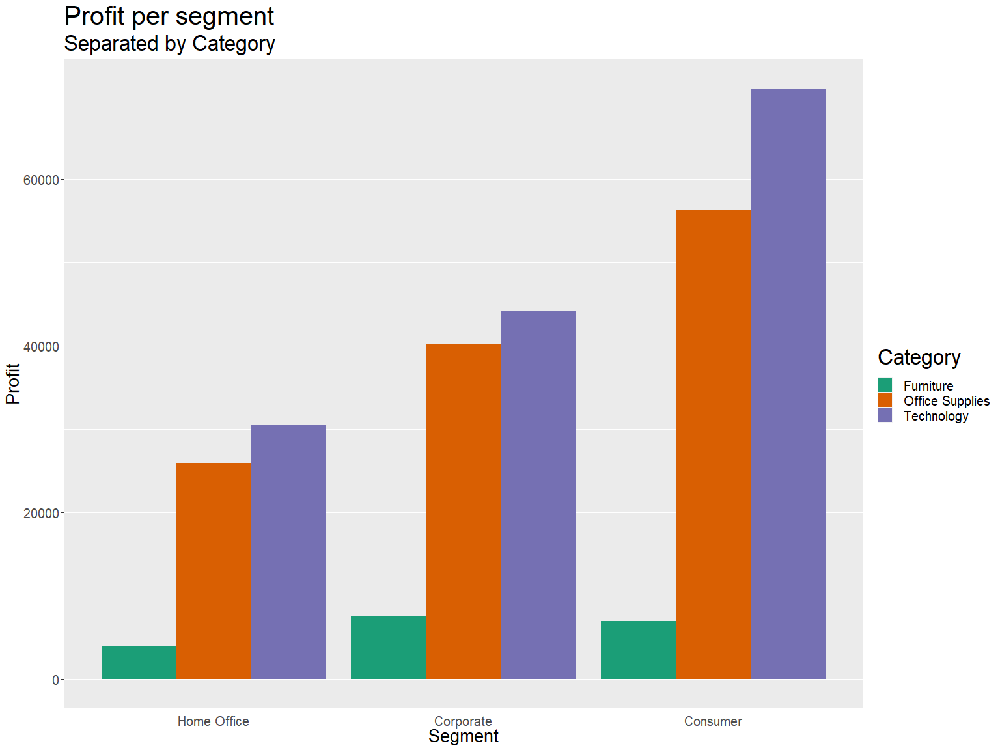
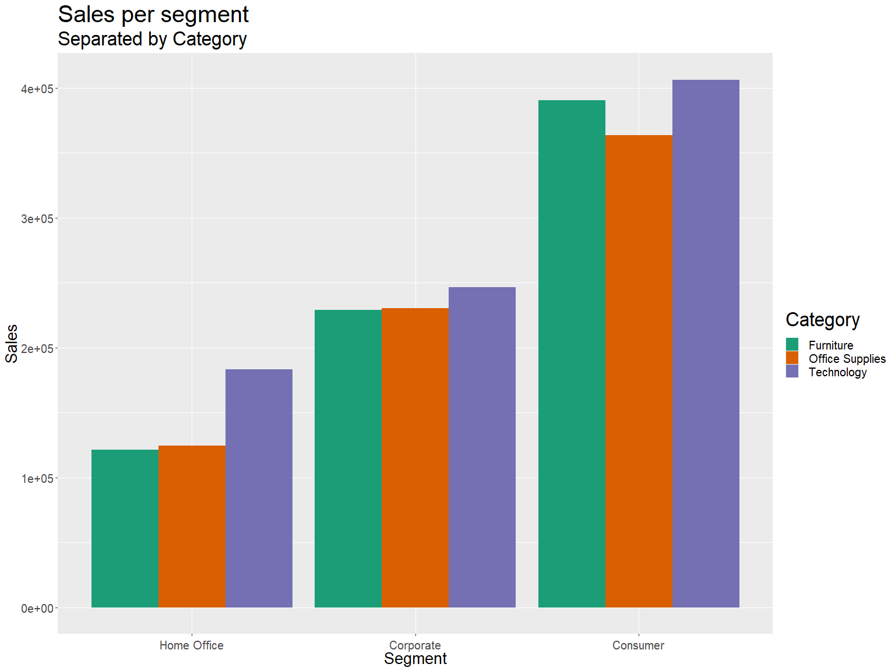

# Business Analytics


## Data Preprocessing

### Read data


```r
store <- read.csv("SampleSuperstore.csv")
head(store)
```

```
##        Ship.Mode   Segment       Country            City      State Postal.Code
## 1   Second Class  Consumer United States       Henderson   Kentucky       42420
## 2   Second Class  Consumer United States       Henderson   Kentucky       42420
## 3   Second Class Corporate United States     Los Angeles California       90036
## 4 Standard Class  Consumer United States Fort Lauderdale    Florida       33311
## 5 Standard Class  Consumer United States Fort Lauderdale    Florida       33311
## 6 Standard Class  Consumer United States     Los Angeles California       90032
##   Region        Category Sub.Category    Sales Quantity Discount    Profit
## 1  South       Furniture    Bookcases 261.9600        2     0.00   41.9136
## 2  South       Furniture       Chairs 731.9400        3     0.00  219.5820
## 3   West Office Supplies       Labels  14.6200        2     0.00    6.8714
## 4  South       Furniture       Tables 957.5775        5     0.45 -383.0310
## 5  South Office Supplies      Storage  22.3680        2     0.20    2.5164
## 6   West       Furniture  Furnishings  48.8600        7     0.00   14.1694
```


### Check for NAs and duplicates


```r
nrow(store)
```

```
## [1] 9994
```


```r
nrow(distinct(store))
```

```
## [1] 9977
```

Thus, we can see duplicates are present.


```r
nrow(which(is.na(store)))
```

```
## NULL
```

There aren't any missing values. Thus we need only to drop duplicates.


```r
store <- distinct(store)
nrow(store)
```

```
## [1] 9977
```

## State-wise analysis


```r
# we need to see the overall Sales and Profits in each State
state_data <- store %>% 
  select(State, Sales, Profit, Discount) %>% 
    group_by(State) %>% 
      summarise(Sale = sum(Sales), Profits = sum(Profit), Discounts = sum(Discount), .groups = "keep")

state_data
```

```
## # A tibble: 49 x 4
## # Groups:   State [49]
##    State                   Sale Profits Discounts
##    <chr>                  <dbl>   <dbl>     <dbl>
##  1 Alabama               19511.   5787.       0  
##  2 Arizona               35282.  -3428.      68  
##  3 Arkansas              11678.   4009.       0  
##  4 California           457576.  76331.     146. 
##  5 Colorado              32108.  -6528.      57.6
##  6 Connecticut           13384.   3511.       0.6
##  7 Delaware              27451.   9977.       0.6
##  8 District of Columbia   2865.   1060.       0  
##  9 Florida               89474.  -3399.     115. 
## 10 Georgia               49096.  16250.       0  
## # ... with 39 more rows
```


```r
state_sale <- ggplot(state_data, aes(x = reorder(State,Sale), y = Sale/1000)) + geom_col(fill = "darkblue")
state_sale <- state_sale + theme(axis.text.x = element_text(angle = 90, size = 15, vjust = 0.1), 
                                     axis.title = element_text(size = 20),
                                     axis.text.y = element_text(size = 15),
                                     title = element_text(size = 25))
state_sale <- state_sale + labs(x = "States", y = "Total Sales (in thousands)", title = "Total Sales per State")
state_sale
```

<!-- -->


```r
state_profit <- ggplot(state_data, aes(x = reorder(State, Profits), y = Profits/1000)) + geom_col(fill = "darkgreen")
state_profit <- state_profit + theme(axis.text.x = element_text(angle = 90, size = 15, vjust = 0.1), 
                                     axis.title = element_text(size = 20),
                                     axis.text.y = element_text(size = 15),
                                     title = element_text(size = 25))
state_profit <- state_profit + labs(x = "States", y = "Total Profits (in thousands)", title = "Total Profit per State")
state_profit
```

<!-- -->


```r
state_disc <- ggplot(state_data, aes(x = reorder(State, Discounts), y = Discounts)) + geom_col(fill = "darkred")
state_disc <- state_disc + theme(axis.text.x = element_text(angle = 90, size = 15, vjust = 0.1), 
                                     axis.title = element_text(size = 20),
                                     axis.text.y = element_text(size = 15),
                                     title = element_text(size = 25))
state_disc <- state_disc + labs(x = "States", y = "Total Discount", title = "Total Discount per State")
state_disc
```

<!-- -->

#### From these three plots, we can see that the States providing the greatest discounts are the ones facing the greatest losses, i.e. Texas.

## Category-wise analysis

### Extract necessary data

```r
cat_data <- store %>% 
  select(Category, Sales, Profit, Discount, Quantity,) %>% 
    group_by(Category) %>% 
      summarise(Sale = sum(Sales), Profits = sum(Profit), 
                Discounts = sum(Discount), Quantity = sum(Quantity), .groups = "keep")

cat_data
```

```
## # A tibble: 3 x 5
## # Groups:   Category [3]
##   Category           Sale Profits Discounts Quantity
##   <chr>             <dbl>   <dbl>     <dbl>    <int>
## 1 Furniture       741306.  18422.      369.     8020
## 2 Office Supplies 718735. 122365.      946.    22861
## 3 Technology      836154. 145455.      244.     6939
```
### Create a sales donut

```r
# Sales across categories
sdata <- cat_data %>% select(Category, Sale)
sdata$fraction <- sdata$Sale / sum(sdata$Sale)

# Compute the cumulative percentages (top of each rectangle)
sdata$ymax <- cumsum(sdata$fraction)

# Compute the bottom of each rectangle
sdata$ymin <- c(0, head(sdata$ymax, n=-1))

# Compute label position
sdata$labelPosition <- (sdata$ymax + sdata$ymin) / 2

# Compute a good label
sdata$label <- sprintf("%0.2f%%", sdata$fraction*100)

# Make the plot
p1 <- ggplot(sdata, aes(ymax=ymax, ymin=ymin, xmax=4, xmin=3, fill=Category)) +
  geom_rect() +
  geom_text( x=2, aes(y=labelPosition, label=label, color=Category), size=6) +
  scale_fill_brewer(palette="Dark2") +
  scale_color_brewer(palette="Dark2") +
  coord_polar(theta="y") +
  xlim(c(0, 4)) +
  theme_void() + labs(title = "Sales across Category") +
  theme(title = element_text(size = 25), legend.text = element_text(size = 15))
```

### Create a profits donut

```r
# Profit across categories
pdata <- cat_data %>% select(Category, Profits)
pdata$fraction <- pdata$Profits / sum(pdata$Profits)

# Compute the cumulative percentages (top of each rectangle)
pdata$ymax <- cumsum(pdata$fraction)

# Compute the bottom of each rectangle
pdata$ymin <- c(0, head(pdata$ymax, n=-1))

# Compute label position
pdata$labelPosition <- (pdata$ymax + pdata$ymin) / 2

# Compute a good label
pdata$label <- sprintf("%0.2f%%", pdata$fraction*100)

# Make the plot
p2 <- ggplot(pdata, aes(ymax=ymax, ymin=ymin, xmax=4, xmin=3, fill=Category)) +
  geom_rect() +
  geom_text( x=2, aes(y=labelPosition, label=label, color=Category), size=6) +
  scale_fill_brewer(palette="Dark2") +
  scale_color_brewer(palette="Dark2") +
  coord_polar(theta="y") +
  xlim(c(0, 4)) +
  theme_void() + labs(title = "Profit across Category") +
  theme(title = element_text(size = 25), legend.text = element_text(size = 15))
```

### Create a quantity donut

```r
# quantity across categories
qdata <- cat_data %>% select(Category, Quantity)
qdata$fraction <- qdata$Quantity / sum(qdata$Quantity)

# Compute the cumulative percentages (top of each rectangle)
qdata$ymax <- cumsum(qdata$fraction)

# Compute the bottom of each rectangle
qdata$ymin <- c(0, head(qdata$ymax, n=-1))

# Compute label position
qdata$labelPosition <- (qdata$ymax + qdata$ymin) / 2

# Compute a good label
qdata$label <- sprintf("%0.2f%%", qdata$fraction*100)

# Make the plot
p3 <- ggplot(qdata, aes(ymax=ymax, ymin=ymin, xmax=4, xmin=3, fill=Category)) +
  geom_rect() +
  geom_text( x=2, aes(y=labelPosition, label=label, color=Category), size=6) +
  scale_fill_brewer(palette="Dark2") +
  scale_color_brewer(palette="Dark2") +
  coord_polar(theta="y") +
  xlim(c(0, 4)) +
  theme_void() + labs(title = "Quantity across Category") +
  theme(title = element_text(size = 25), legend.text = element_text(size = 15))
```

### Create a discount donut

```r
# Discount across categories
ddata <- cat_data %>% select(Category, Discounts)
ddata$fraction <- ddata$Discounts / sum(ddata$Discounts)

# Compute the cumulative percentages (top of each rectangle)
ddata$ymax <- cumsum(ddata$fraction)

# Compute the bottom of each rectangle
ddata$ymin <- c(0, head(ddata$ymax, n=-1))

# Compute label position
ddata$labelPosition <- (ddata$ymax + ddata$ymin) / 2

# Compute a good label
ddata$label <- sprintf("%0.2f%%",ddata$fraction*100)

# Make the plot
p4 <- ggplot(ddata, aes(ymax=ymax, ymin=ymin, xmax=4, xmin=3, fill=Category)) +
  geom_rect() +
  geom_text( x=2, aes(y=labelPosition, label=label, color = Category),size=6) +
  scale_fill_brewer(palette="Dark2") +
  scale_color_brewer(palette="Dark2") +
  coord_polar(theta="y") +
  xlim(c(0, 4)) +
  theme_void() + labs(title = "Discount across Category") +
  theme(title = element_text(size = 25), legend.text = element_text(size = 15))
```

### Display all donut charts

```r
grid.arrange(p1, p2, p3, p4, nrow=2)
```

<!-- -->


#### From these plot we can incur that Technology category provides the highest profits while selling the lowest quantities.

## Subcategory analysis


```r
sub <- store %>% select(Category, Sub.Category, Profit) %>%
  group_by(Category, Sub.Category) %>% summarise(Profit = sum(Profit), .groups = "keep")
subcat <- ggplot(sub, aes(x = reorder(Sub.Category, Profit), y = Profit/1000, fill = Category)) + geom_col()
subcat <- subcat + theme(axis.text.x = element_text(angle = 90, size = 15, vjust = 0.1), 
                         axis.title = element_text(size = 20),
                         axis.text.y = element_text(size = 15),
                         title = element_text(size = 25),
                         legend.text = element_text(size = 15)) + scale_fill_brewer(palette = "Dark2")
subcat<- subcat + labs(x = "Subcategory", y = "Profit (in thousand)", title = "Profit per Subcategory") 
subcat
```

<!-- -->
#### From this we can see which subcategories show the highest profits and the greatest losses.


```r
sub2 <- store %>% select(Category, Sub.Category, Sales) %>%
  group_by(Category, Sub.Category) %>% summarise(Sales = sum(Sales), .groups = "keep")
subcat2 <- ggplot(sub2, aes(x = reorder(Sub.Category, Sales), y = Sales/1000, fill = Category)) + geom_col()
subcat2 <- subcat2 + theme(axis.text.x = element_text(angle = 90, size = 15, vjust = 0.1), 
                         axis.title = element_text(size = 20),
                         axis.text.y = element_text(size = 15),
                         title = element_text(size = 25),
                         legend.text = element_text(size = 15)) + scale_fill_brewer(palette = "Dark2")
subcat2<- subcat2 + labs(x = "Subcategory", y = "Sales (in thousand)", title = "Sales per Subcategory") 
subcat2
```

<!-- -->
#### From this we can see which subcategories show the greatest sales.


```r
sub3 <- store %>% select(Category, Sub.Category, Quantity) %>%
  group_by(Category, Sub.Category) %>% summarise(Q = sum(Quantity), .groups = "keep")
subcat3 <- ggplot(sub3, aes(x = reorder(Sub.Category, Q), y = Q, fill = Category)) + geom_col()
subcat3 <- subcat3 + theme(axis.text.x = element_text(angle = 90, size = 15, vjust = 0.1), 
                         axis.title = element_text(size = 20),
                         axis.text.y = element_text(size = 15),
                         title = element_text(size = 25),
                         legend.text = element_text(size = 15)) + scale_fill_brewer(palette = "Dark2")
subcat3<- subcat3 + labs(x = "Subcategory", y = "Quantity", title = "Amount per Subcategory") 
subcat3
```

<!-- -->

#### From these plots we can also see that the Copiers, which sold the least quantities brought in the greatest profit.

## Segment based analysis

### Separaing necessary data

```r
seg <- store %>% 
  select(Segment, Sales, Profit, Category) %>%
    group_by(Segment, Category) %>%
    summarise(Sales = sum(Sales), Profit = sum(Profit), .groups = "keep")
seg
```

```
## # A tibble: 9 x 4
## # Groups:   Segment, Category [9]
##   Segment     Category          Sales Profit
##   <chr>       <chr>             <dbl>  <dbl>
## 1 Consumer    Furniture       390659.  6956.
## 2 Consumer    Office Supplies 363774. 56254.
## 3 Consumer    Technology      406400. 70798.
## 4 Corporate   Furniture       229020.  7585.
## 5 Corporate   Office Supplies 230600. 40203.
## 6 Corporate   Technology      246450. 44167.
## 7 Home Office Furniture       121627.  3881.
## 8 Home Office Office Supplies 124361. 25908.
## 9 Home Office Technology      183304. 30490.
```

### Plotting Profit vs Segment

```r
seg_prof <- ggplot(seg, aes(x = reorder(Segment, Profit), y = Profit, fill=Category)) + geom_col(position = "dodge") 
seg_prof <- seg_prof + theme(axis.text.x = element_text(size = 15, vjust = 0.1), 
                         axis.title = element_text(size = 20),
                         axis.text.y = element_text(size = 15),
                         title = element_text(size = 25),
                         legend.text = element_text(size = 15)) + scale_fill_brewer(palette = "Dark2")
seg_prof <- seg_prof + labs(x = "Segment", y = "Profit", title = "Profit per segment", subtitle = "Separated by Category")
seg_prof
```

<!-- -->

### Plotting Sales vs Segment

```r
seg_sale <- ggplot(seg, aes(x = reorder(Segment, Sales), y = Sales, fill=Category)) + geom_col(position = "dodge") 
seg_sale <- seg_sale + theme(axis.text.x = element_text(size = 15, vjust = 0.1), 
                         axis.title = element_text(size = 20),
                         axis.text.y = element_text(size = 15),
                         title = element_text(size = 25),
                         legend.text = element_text(size = 15)) + scale_fill_brewer(palette = "Dark2")
seg_sale <- seg_sale + labs(x = "Segment", y = "Sales", title = "Sales per segment", subtitle = "Separated by Category")
seg_sale
```

<!-- -->

From this graph we can analyze which Segment to target for any given Category.


